# 🧲 Magnetto 설치 안내

인스타그램·유튜브·페이스북 등 **공개된 웹 영상을 내 PC에 저장**하는 무료 프로그램입니다.
Windows와 Mac에서 쓸 수 있습니다.

### 📖 [그림으로 보는 설치 안내 (웹 페이지)](https://demian-yim.github.io/magnetto-release/)
### ⬇️ [최신 버전 내려받기 (Releases)](https://github.com/Demian-Yim/magnetto-release/releases/latest)

> 제작: **Demin Yim · FLOW : AX디자인연구소** · rescuemyself@gmail.com

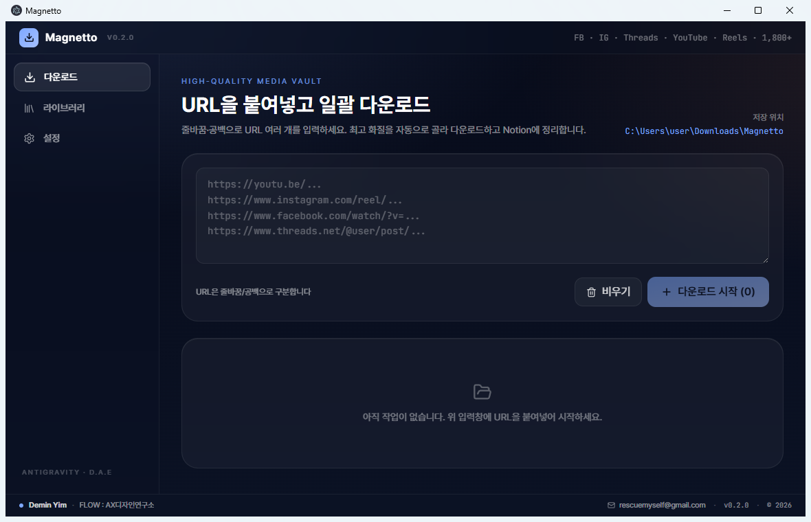

---

## 1. 내 컴퓨터에 맞는 파일 고르기

| 내 컴퓨터 | 받을 파일 |
|---|---|
| **Windows** (10·11) | [`Magnetto-Setup-0.2.0-win-x64.exe`](https://github.com/Demian-Yim/magnetto-release/releases/download/v0.2.0/Magnetto-Setup-0.2.0-win-x64.exe) |
| **Mac** — Apple 칩 (M1·M2·M3·M4) | [`Magnetto-0.2.0-mac-arm64.dmg`](https://github.com/Demian-Yim/magnetto-release/releases/download/v0.2.0/Magnetto-0.2.0-mac-arm64.dmg) |
| **Mac** — Intel 칩 | [`Magnetto-0.2.0-mac-x64.dmg`](https://github.com/Demian-Yim/magnetto-release/releases/download/v0.2.0/Magnetto-0.2.0-mac-x64.dmg) |

**내 Mac이 어떤 칩인지 확인하는 법:** 화면 왼쪽 위 사과(🍎) 메뉴 → **이 Mac에 관하여**
→ **칩** 항목에 "Apple M…"이 보이면 Apple 칩, **프로세서** 항목에 "Intel"이 보이면 Intel입니다.

---

## 2. Windows 설치

1. `Magnetto-Setup-….exe`를 더블클릭합니다.

2. 파란 창 **"Windows의 PC 보호"**가 뜨면
   → 창 안의 **추가 정보**를 누르고 → 아래에 생기는 **실행** 버튼을 누릅니다.

   > **왜 경고가 뜨나요?** 이 프로그램에는 해마다 비용을 내야 하는 "제작자 인증서"(코드서명)가 붙어 있지 않습니다.
   > 바이러스라서가 아니라, 인증서가 없는 프로그램에 Windows가 자동으로 붙이는 안내입니다.
   > 미덥지 않으시면 아래 **7. 받은 파일이 진짜인지 확인하기**로 직접 검증하실 수 있습니다.

3. **사용 안내 및 고지** 화면을 읽고 **동의함**을 누릅니다.

   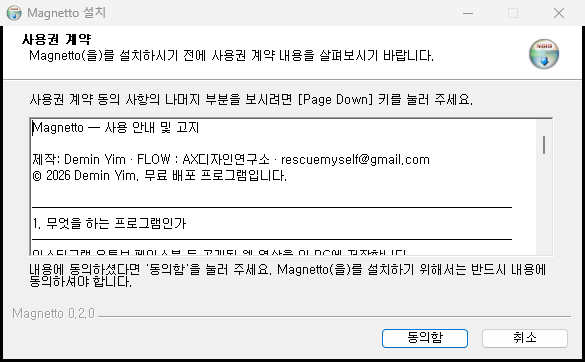

4. **설치 위치**는 그대로 두고 **설치**를 누릅니다.

   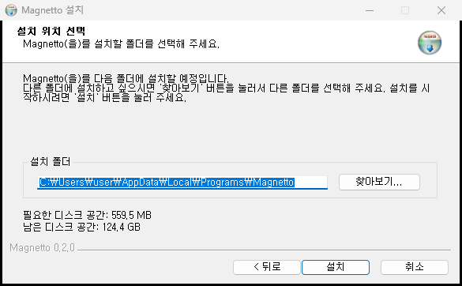

5. 1~2분 기다리면 끝납니다. **마침**을 누르세요.

   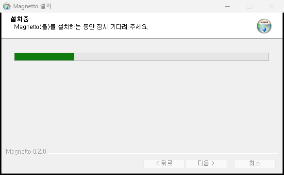

6. 바탕화면의 **Magnetto** 아이콘으로 실행합니다.

**지우고 싶을 때:** Windows **설정 → 앱 → 설치된 앱 → Magnetto → 제거**

---

## 3. Mac 설치

1. `Magnetto-….dmg`를 더블클릭해 엽니다.
2. 열린 창에서 **Magnetto 아이콘을 Applications(응용 프로그램) 폴더로 끌어다 놓습니다.**
3. **응용 프로그램** 폴더에서 Magnetto를 더블클릭합니다.
4. **"Apple은 'Magnetto'에 … 악성 코드가 없음을 확인할 수 없습니다"** 같은 창이 뜨면 **완료**를 누릅니다.
5. 🍎 메뉴 → **시스템 설정** → 왼쪽 **개인정보 보호 및 보안** → 오른쪽을 아래로 내리면
   **"'Magnetto'이(가) 차단되었습니다"** 문구 옆에 **그래도 열기** 버튼이 있습니다. 누릅니다.
6. Mac 암호를 입력하고, 다시 뜨는 창에서 **그래도 열기**를 누르면 실행됩니다.
   이 과정은 **처음 한 번만** 하면 됩니다.

> 화면 문구는 macOS 버전에 따라 조금 다를 수 있습니다. Mac 화면 사진은 아직 준비하지 못했습니다.

**그래도 열리지 않으면 (마지막 방법):**
**응용 프로그램 → 유틸리티 → 터미널**을 열고 아래 한 줄을 붙여 넣은 뒤 Enter를 누릅니다.

```
xattr -dr com.apple.quarantine /Applications/Magnetto.app
```

**지우고 싶을 때:** 응용 프로그램 폴더의 Magnetto를 휴지통으로 옮기면 됩니다.

---

## 4. 사용법 (3단계)

### ① 주소를 붙여 넣습니다

영상 주소(URL)를 입력칸에 붙여 넣습니다. 여러 개면 **한 줄에 하나씩** 넣으세요.
몇 개가 인식됐는지 버튼에 숫자로 표시됩니다.

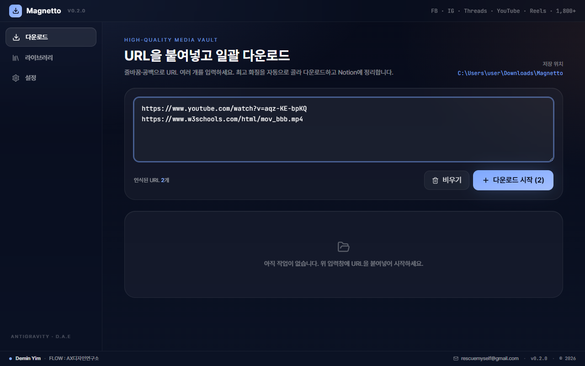

### ② 다운로드 시작을 누릅니다

제목·채널·길이·미리보기 그림을 찾아온 뒤, 화질을 자동으로 가장 좋은 것으로 골라 받습니다.

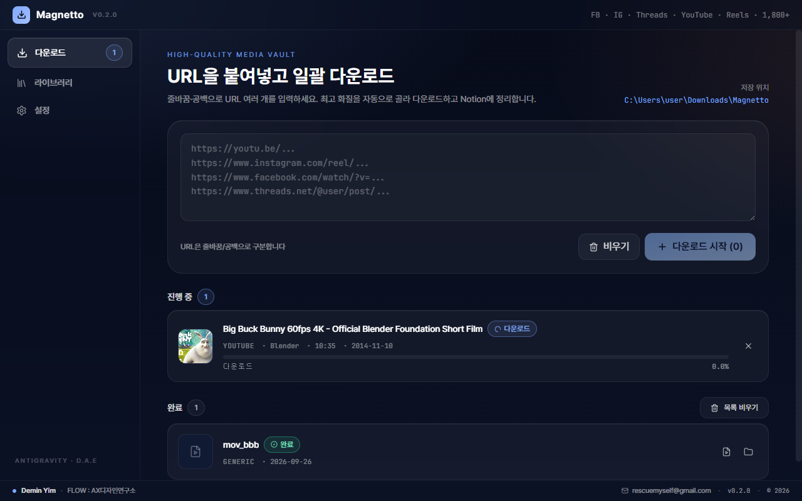

### ③ 끝나면 폴더를 엽니다

완료 목록의 폴더 버튼을 누르면 저장된 폴더가 바로 열립니다.
받은 파일은 사이트별 폴더(Youtube · Instagram …)로 자동 분류됩니다.

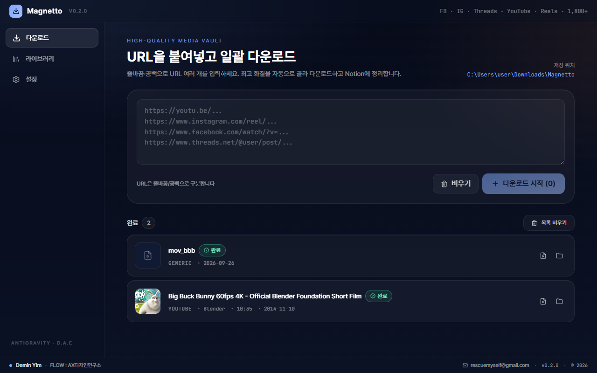

지난 기록은 **라이브러리** 메뉴에서 다시 볼 수 있습니다.

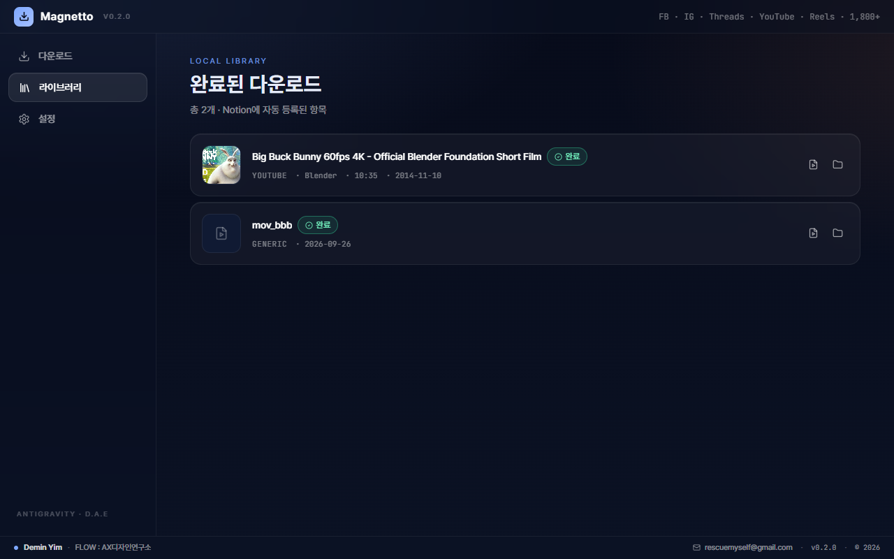

### 바꿀 수 있는 것들

저장 폴더, 화질, 파일 형식, 동시에 받는 개수, 폴더 정리 방식을 **설정**에서 바꿀 수 있습니다.
다운로드 엔진(yt-dlp)은 앱을 켤 때 자동으로 최신으로 맞춰집니다.

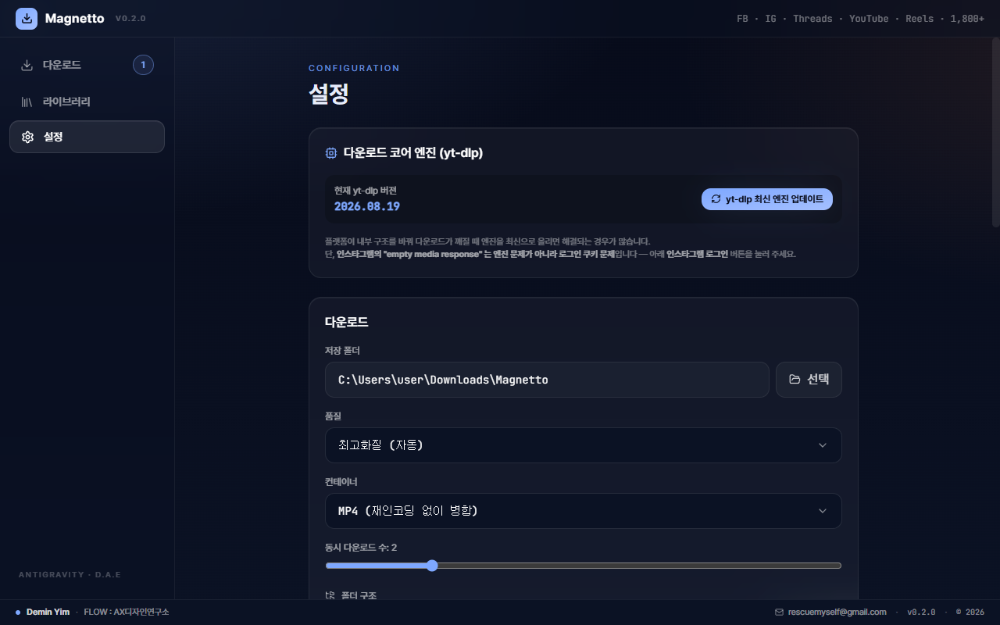

---

## 5. 인스타그램에서 "로그인이 필요합니다"라고 나올 때

인스타그램은 연령·지역 제한이 있거나 특정 대상에게만 공개된 게시물을 로그인 없이는 내주지 않습니다.

**설정 → 로그인 쿠키 → 인스타그램 로그인** 버튼을 누르세요.

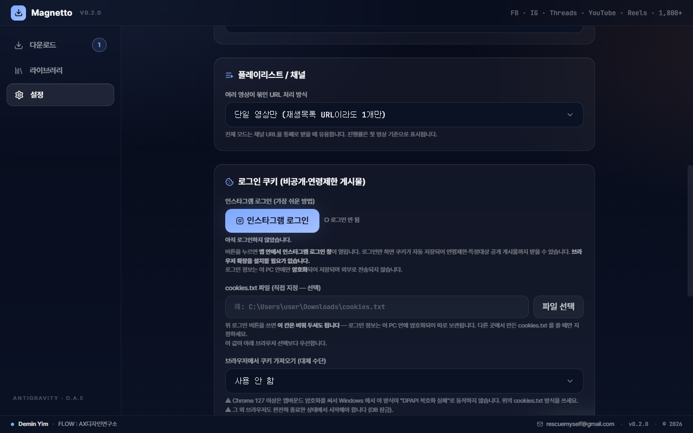

**앱 안에서 인스타그램 로그인 창이 열립니다.** 평소처럼 로그인하면 끝이고,
브라우저 확장 프로그램을 따로 설치할 필요가 없습니다.

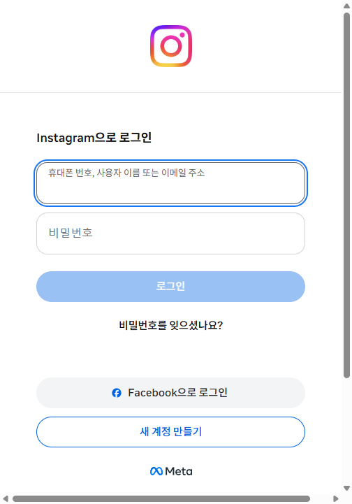

- 로그인 정보는 **이 컴퓨터 안에만 암호화되어** 저장되며, 어디로도 전송되지 않습니다.
- 여러 사람이 함께 쓰는 컴퓨터라면 사용 후 같은 화면에서 **로그아웃**을 눌러 주세요.

---

## 6. 꼭 지켜 주세요

| | 내용 |
|---|---|
| ⚖️ **저작권** | 받은 영상의 저작권은 원래 게시자에게 있습니다. **개인 보관·학습 인용·내가 올린 영상 되찾기**에만 쓰세요. 다시 올리거나 상업적으로 쓰면 안 됩니다. |
| 📵 **인스타 계정 보호** | 짧은 시간에 너무 많이 받으면 인스타그램이 자동 수집으로 보고 **로그인한 내 계정을 제한**할 수 있습니다. **설정 → 동시 다운로드 수는 1~2개**를 권장합니다. |
| 🔒 **보증 없음** | 사이트 정책이 바뀌면 일부 영상이 받아지지 않을 수 있습니다. |

---

## 7. 자주 묻는 문제

| 증상 | 해결 |
|---|---|
| "다운로드 엔진을 찾지 못했습니다" | 백신 프로그램이 엔진 파일을 격리했을 수 있습니다. 백신의 격리 목록에서 Magnetto 관련 파일을 복원하고 다시 설치해 주세요. |
| 인스타그램 "로그인이 필요합니다" | 위 **5. 인스타그램 로그인**을 진행하세요. 이미 했다면 **다시 로그인**을 누르세요. |
| "요청 속도를 제한했습니다" | 설정에서 동시 다운로드 수를 1로 낮추고 몇 분 뒤 다시 시도하세요. |
| 예전에 되던 사이트가 갑자기 안 됨 | Magnetto를 껐다 켜면 다운로드 엔진이 자동으로 최신 버전으로 바뀝니다. |

---

## 8. (선택) 받은 파일이 진짜인지 확인하기

[Releases](https://github.com/Demian-Yim/magnetto-release/releases/latest) 페이지의 `SHA256SUMS.txt`에 각 파일의 고유 번호(해시)가 있습니다. 받은 파일의 번호와 같으면 중간에 바뀌지 않은 원본입니다.

- **Windows** (PowerShell): `Get-FileHash .\Magnetto-Setup-0.2.0-win-x64.exe`
- **Mac** (터미널): `shasum -a 256 ~/Downloads/Magnetto-0.2.0-mac-arm64.dmg`

---

Magnetto는 오픈소스 [yt-dlp](https://github.com/yt-dlp/yt-dlp)(Unlicense)와 [FFmpeg](https://ffmpeg.org)(LGPL/GPL)를 사용합니다.
라이선스 전문은 설치 폴더의 `LICENSE-NOTICE.txt` · `bin/FFMPEG-LICENSE.txt`, 그리고 이 저장소의 [LICENSE-NOTICE.txt](LICENSE-NOTICE.txt)에 있습니다.

> 이 저장소에는 **설치파일과 안내문만** 있습니다. 문의: rescuemyself@gmail.com

**Demin Yim · FLOW : AX디자인연구소** · rescuemyself@gmail.com · © 2026
